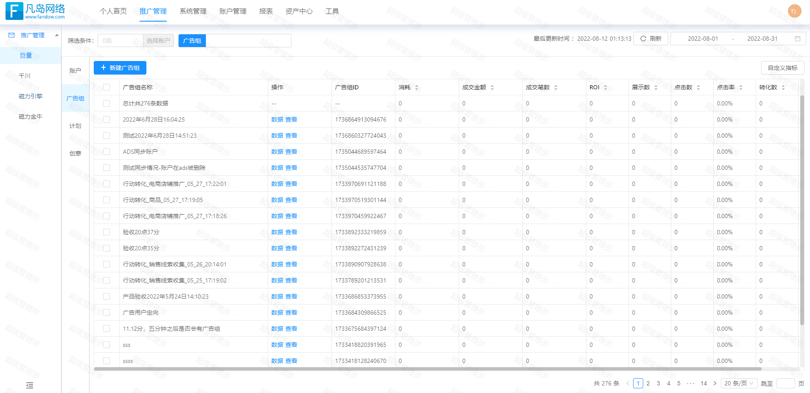
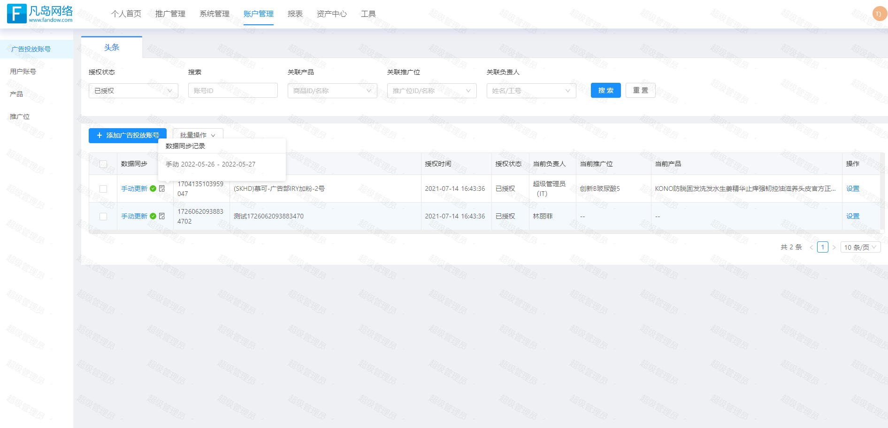
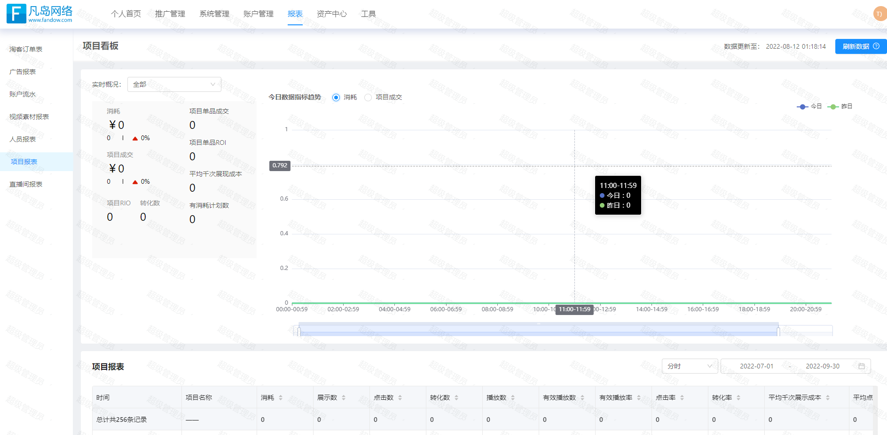
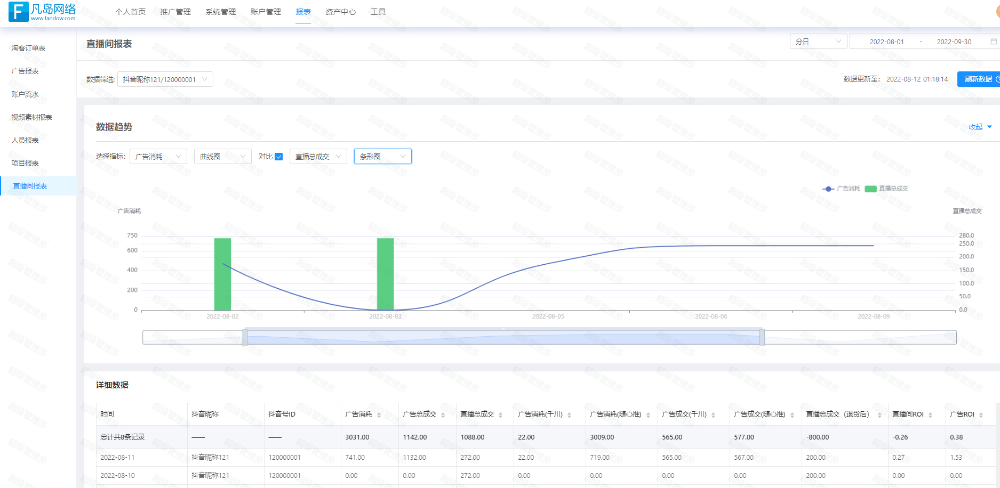
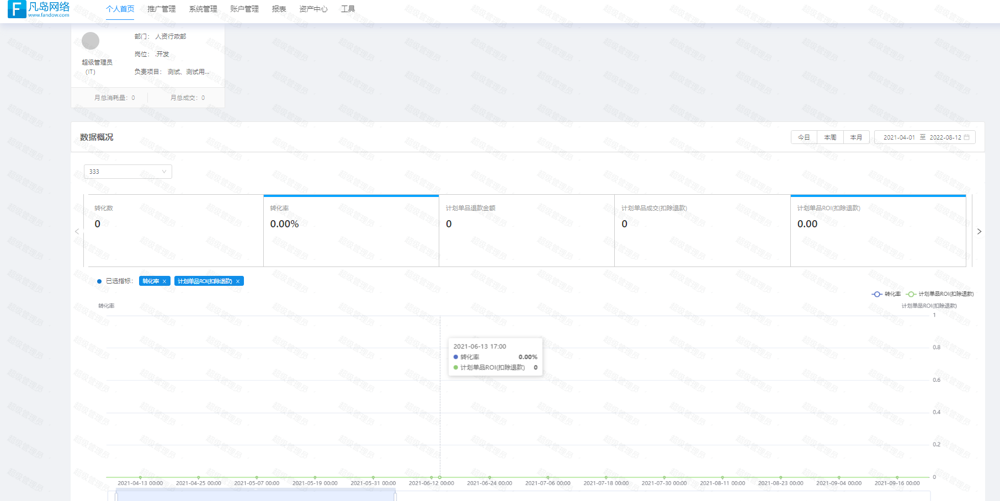
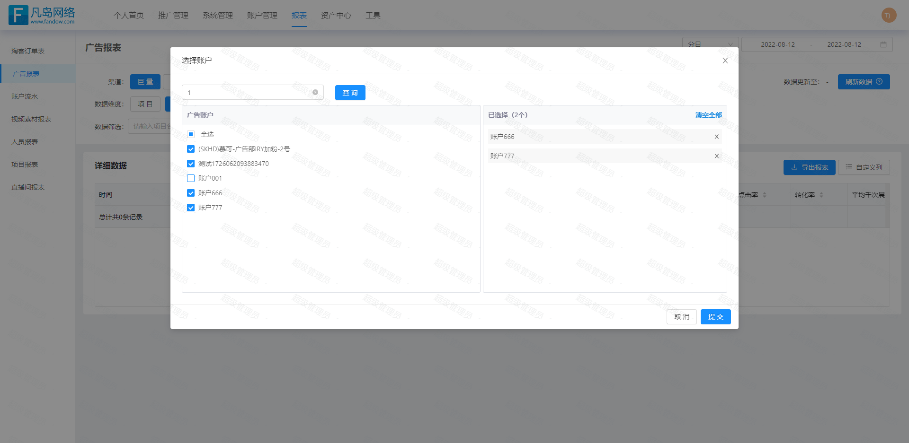

:::tip 项目介绍
针对用户的线上访问行为、消费行为、业务操作行为进行统计分析，数据挖掘。主要有推广管理、系统管理、资产中
心、账户管理、报表等模块，实现公司的业务运营、精准画像营销、个性化推荐等，来提高业务转化率，改善公司运营效果。
:::

<!-- more -->

:::warning 技术栈
Vue3 全家桶，axios，Ant Design Vue，Echarts，Nuxt.js
:::

:::danger 个人职责 
1.负责推广管理、系统管理、报表等模块的开发工作   

2.基于蚂蚁金服的可视化工具 AntV 的 G2 及 G2Plot 实现数据图标等数据可视化功能  

3.根据账户权限，配置页面权限来实现路由级别的权限管理，使用自定义指令来实现按钮的权限管理  

4.遵循组件化开发思想，每个页面每个功能块抽离封装成页面的子组件，保证代码整体美观，并大量封装业务组件进行复用
:::

### 项目截图

