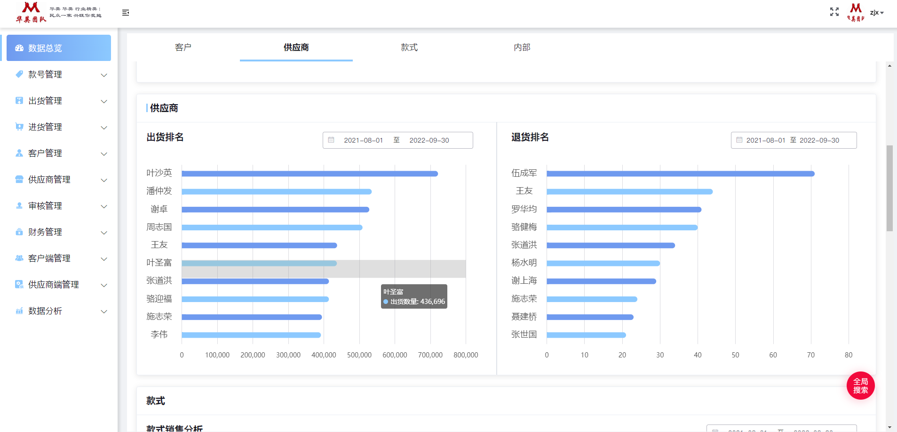

:::tip 项目介绍
该ERP系统集成了华英服装管理体系下的进出货管理、款号管理、客户与供应商管理、财务管理、数据分析等模块，并
采用多角色权限分控方案，实现了对管理员，财务人员、仓管人员、客户等多用户的分权限管理方案。
:::

<!-- more -->

:::warning 技术栈
Vue2.6，vue-router，vuex，axios，Element-ui，Echarts, vue-print
:::

:::danger 职责/技术描述/重难点：
1.项目基于Vue-cli2开发，使用Element-ui搭配部分自定义功能组件实现大部分功能模块开发，通过对项目进行分析和构思，将
页面及路由合理拆分，并抽取可复用组件，力求高内聚低耦合  

2.负责报单管理、配货出货、供应商、客户管理等模块的开发工作  

3.基于RBAC权限模型设计权限系统，通过全局导航守卫配合用户合法路由表鉴权，实现管理控制各级用户的路由访问权限  

4.通过vuex存储用户信息，用户按键权限表，实现了对用户操作的权限控制  

5.使用axios进行网络请求，并实现了对网络请求部分的完全封装，使用请求拦截器阻止重复请求，使用响应拦截器处理解构成功
请求，优化返回格式，处理失败请求，优化全局错误捕获机制。  

6.通过Echarts 实现各类统计数据可视化，包括库存占比饼图，销售单日期数量折线图，财务收款出款分析图等图表，以直观展示
数据，并且通过使用自定义theme主题，保证图表风格统一美观。  

7.抽取列表及分页组件的mixin文件，开放自建操作接口生命周期钩子函数，大幅度缩减重复性代码，避免了重复性工作  

8.通过vue-print实现多各模块内单据打印功能，使用打印模板类对页头，标题及打印单详细信息、样式等内容进行定义与规范，
筛选循环选中内容有效信息并进行模板组合，最终掉用浏览器打印API实现单据打印。  

9.通过git管理代码，通过eslint，prettier 规范代码风格并进行代码检测  
:::

### 项目截图

